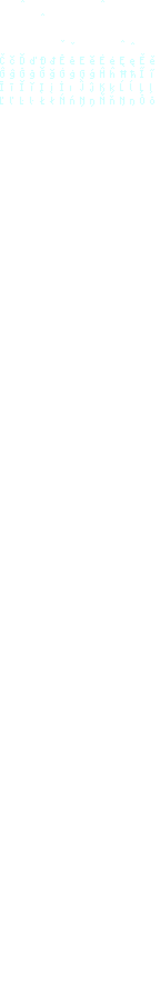

# Mojangles*s*
### Description
Mojangles*s* is a thinner version of default minecraft mojangles font, that was inspired by font of [Faithless](https://modrinth.com/resourcepack/faithless) resource pack still only using its own textures.

### Important
This version of the font is not is **not** the latest one, so there are many things that have to be done. If you find a bug, please, make sure to report it.

### License
This resource pack works under the [CC-BY-NC 4.0](https://creativecommons.org/licenses/by-nc/3.0/) license.

### Changelog
* Fixed the semicolon symbol.
* Changed the look of the D letter in order to give it a vanilla like look.
* Add some symbols to the `accented.png` file, that you can see here:

